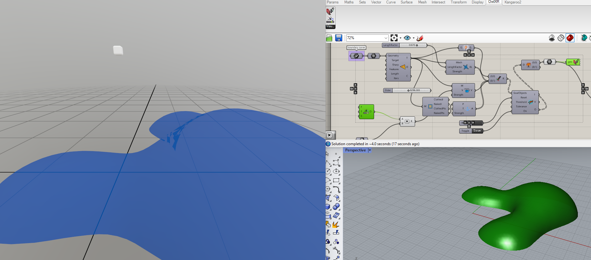

# OwlXR

## Running the project
It is reccomended to first insert the Grasshopper components into the desired .gh file in order for the clients not timing out while looking for the server.

**WARNING:** Currently only Meshes are supported by the client. Other geometry types will be dropped

Usage sample (Grasshopper model source: [Kangaroo-examples by Dan Pike](https://github.com/Dan-Piker/Kangaroo-examples))

## Developing the project

### DotNet
Use this configuration for VR applications (tested on Oculus Rift 2).
To run the client from the terminal navigate to `./owl_uwp-dotnet-android/Platforms/StereoKit_DotNet`

**Running emulator:** `dotnet run` 

**Creating windows executable:** `dotnet publish -c Release -r win10-x64`

These steps can also be performed using Visual Studio

### UWP 
This configuration is used for Launching the applicaiton on the Hololens 2. It has not yet been tested.

### Android
**non-functional**

### Networking details
- Only works for machines connected to the same LAN